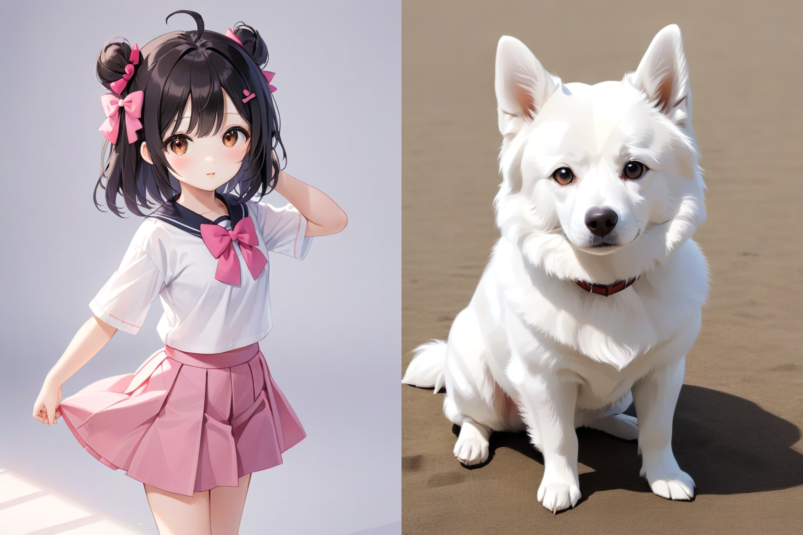

# Character-Consistency Generation
This is a project on character consistency generation using stable diffusion, aiming to address the consistency issues of single-character and multi-character in comic production.

## Consistency Genation of A Single Character
|character|sitting on the bench in the park|flying in the sky near the moon|running in the forest with smile|lying in the bed at night|
|:--:|:--:|:--:|:--:|:--:|
|  |  |  |  ||
|       character       | playing basketball on the playground | playing on the grass with a dog |dancing in the street|sitting on the swimming pool|
|  |             |        |||
|       character       | swimming in the pool | reading books in the library |dancing in the bar|running in the street|
|  |  |  |||
| character | flying in the sky | swimming in the pool |sitting on the bench|reading a book in the library|
|  |  |  |||

## Consistency Genation of Multi Characters

| characters           | drinking wine in the bar | kissing on the grass     | fight with each other in the park | shake hands in the classroom |
| :------------------- | :----------------------- | :----------------------- | :-------------------------------- | :--------------------------- |
|  |  |  |           |      |
| characters           | dancing in the bar       | running in the forest    | reading books in the library      | drinking wine in the room    |
|  |  |  |           |      |
| characters           | dancing in the street    | drinking wine in the bar | eating in the garden              | fight with each other        |
|  |  |  |           |      |

## Consistency Generation with Different Styles

|  |  |  |  |
| --------------------------- | --------------------------- | --------------------------- | --------------------------- |
|  |  |  |  |
|  |  |  |  |
|  |  |  |  |
